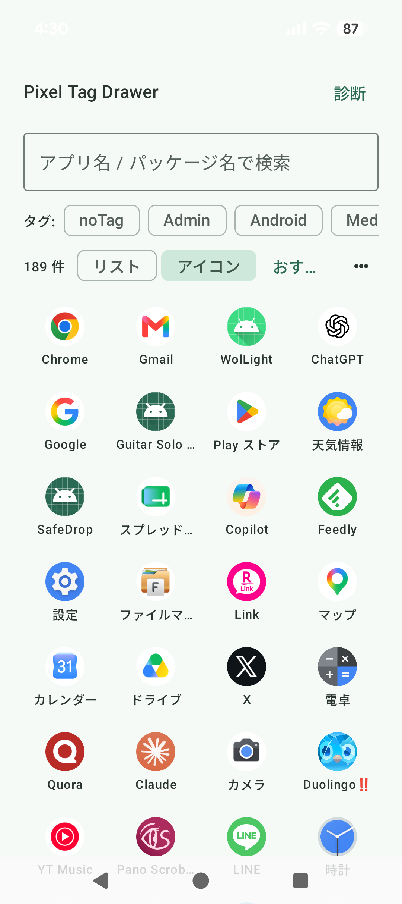
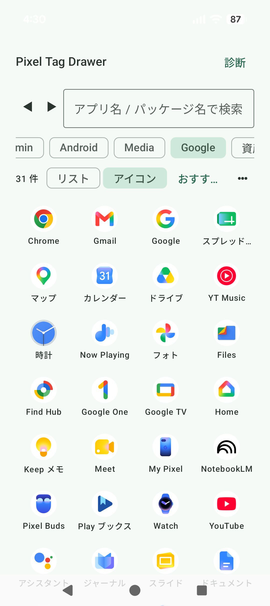
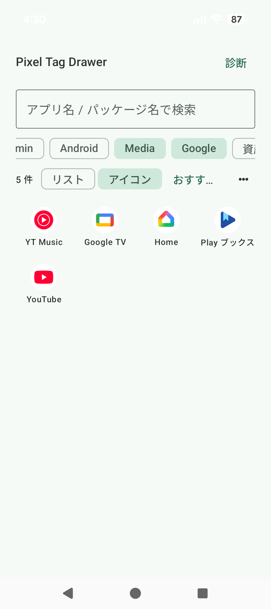
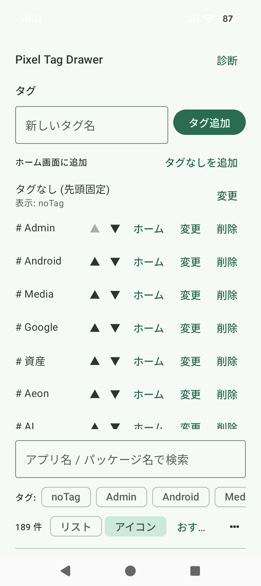

# Pixel Tag Drawer

**Pixel Launcherはそのまま。アプリだけ、自分のタグで整理できます。**

Pixel Tag Drawerは、Pixel Launcherを置き換えずに使うAndroid向けの補助アプリです。
端末上の起動可能なアプリを一覧にし、用途に合わせたタグで整理・絞り込みできます。
HOMEランチャーとしては動作せず、通常のアプリとしてPixel Launcherと併用します。

ビルド設定上のminSdkは26（Android 8.0）です。現在はPixel 10aで開発・動作確認しています。
ほかの端末やランチャーでの動作は未検証であり、正常な動作を保証するものではありません。

## スクリーンショット

<table>
  <tr>
    <td align="center">
      <strong>全アプリ表示</strong><br>
      <sub>すべての起動可能アプリをグリッド表示</sub><br>
      
    </td>
    <td align="center">
      <strong>単一タグで絞り込み</strong><br>
      <sub>Googleタグで対象アプリを絞り込み</sub><br>
      
    </td>
  </tr>
  <tr>
    <td align="center">
      <strong>複数タグのAND絞り込み</strong><br>
      <sub>MediaとGoogleをAND条件で絞り込み</sub><br>
      
    </td>
    <td align="center">
      <strong>タグ管理</strong><br>
      <sub>タグの作成・並べ替え・名前変更・削除</sub><br>
      
    </td>
  </tr>
</table>

## 主な特徴

- 起動可能なアプリを「全アプリ」「選択したタグ」「タグなし」で表示
- 1つのアプリに複数のタグを付与
- 複数タグをすべて持つアプリだけを表示するAND絞り込み
- アプリ名・パッケージ名による検索
- リスト表示とグリッド表示の切り替え
- 名前順、最近起動した順、起動回数順、おすすめ順への並び替え
- タグの作成、名前変更、削除と、アプリへの一括付与・解除
- タグまたは「タグなし」の絞り込みを開くPinned Shortcut

## Usage Access（使用状況へのアクセス）

最近起動した順、起動回数順、おすすめ順では、Androidの`UsageStats`と
`UsageEvents`を使用します。最近起動した順と起動回数順は過去30日、
おすすめ順は直近7日の使用状況を端末内で集計します。

これらの並び順を使うには、Androidの設定画面でPixel Tag Drawerに
「使用状況へのアクセス」を手動で許可する必要があります。通常のランタイム権限ダイアログでは
許可できません。許可しない場合も、名前順、検索、タグ整理、タグ絞り込みなどは利用でき、
使用状況が必要な並び順は名前順へフォールバックします。

## ダウンロード / インストール

GitHubのpre-releaseからAPKをsideloadする形式で配布しています。Google Playでの配布ではありません。

1. [v0.1.2 pre-release](https://github.com/iwadjp/pixel-tag-drawer/releases/tag/v0.1.2) を開く
2. Assetsから`pixel-tag-drawer-v0.1.2-android.apk`をダウンロードする
3. ダウンロードしたAPKをタップしてインストールする

Androidでは、このソースからのアプリインストールを許可するよう求められる場合があります。また Google Play Protect や Android が、Google Play 外で配布された APK に対して警告を表示することがあります。インストールを進める前に、ダウンロードしたAPKが上記の公式GitHub Releaseから取得したものであることを確認してください。

現時点でPixel 10aでのみ動作確認済みです。他の端末やランチャーでの動作は未検証です。

開発用にソースからビルドしたい場合は、以下の「開発環境」「ビルドと検証」を参照してください。

## 開発環境

- JDK 21
- Android SDK 36
- Android Studio、またはAndroid SDKを利用できるコマンドライン環境

Gradle 9.4.1はGradle Wrapperから取得されます。Android SDKの場所は、
追跡対象外の`local.properties`または環境変数で設定してください。

## ビルドと検証

PowerShellでは、リポジトリのルートで次のコマンドを実行します。

```powershell
# Debug APKを作成
.\gradlew.bat assembleDebug

# JVM unit testを実行
.\gradlew.bat testDebugUnitTest

# Android lintを実行
.\gradlew.bat lintDebug
```

macOS/Linuxでは`.\gradlew.bat`を`./gradlew`に読み替えてください。

Debug APKは次の場所に生成されます。

```text
app/build/outputs/apk/debug/app-debug.apk
```

このAPKは開発用のdebug buildです。端末へインストールするには、Android SDK Platform Toolsの
`adb`を使うか、端末側で提供元不明アプリのインストールを許可する必要があります。
既に同じapplication IDのアプリがある場合、署名が異なるAPKでは上書きインストールできません。

## プライバシー

起動可能なアプリの情報、作成したタグ、表示設定、許可された場合の使用状況データは、
現在の実装では端末内で処理されます。アプリは`INTERNET`権限を要求せず、外部サーバーへ
これらのデータを送信する処理も実装していません。

診断ログにはアプリ名やパッケージ名などが含まれる場合があります。ログをコピーして共有する際は、
内容を確認してください。

アプリ内の「⋯」メニューから、上記の内容を含むプライバシーポリシー本文を確認できます。

## License

[MIT License](LICENSE)
