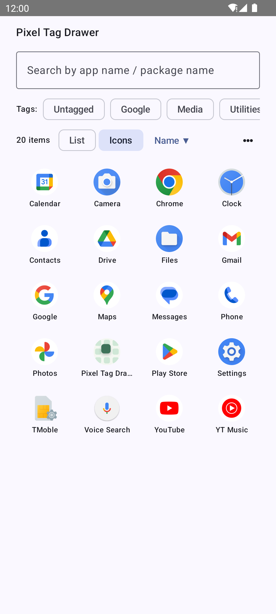
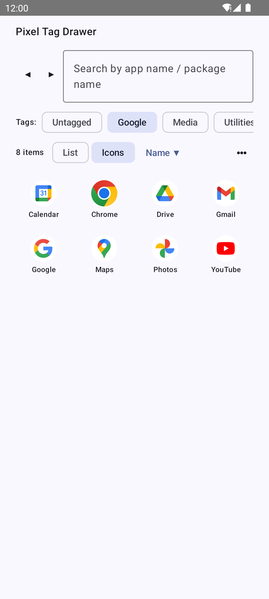
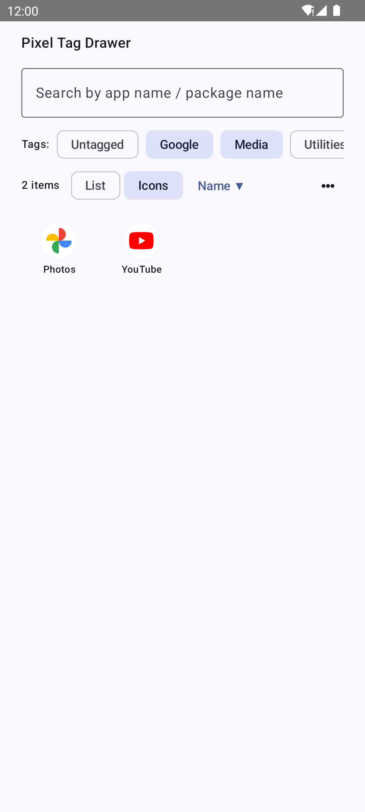
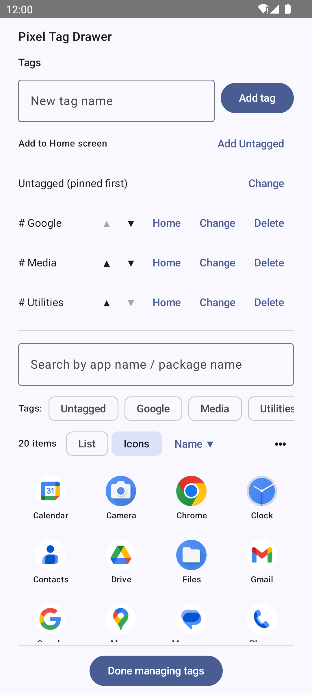

# Pixel Tag Drawer

[English](README.md) | [日本語](README.ja.md)

**Keep Pixel Launcher as it is. Just organize your apps with your own tags.**

Pixel Tag Drawer is a companion app for Android that works alongside Pixel Launcher instead of replacing it.
It lists the launchable apps on your device and lets you organize and filter them with tags that fit how you use them.
It does not act as a home launcher; you use it as a normal app next to Pixel Launcher.

The app UI is **English by default**. If the device language is Japanese, the app shows its Japanese UI instead.
The screenshots below show the English UI.

The build's minSdk is 26 (Android 8.0). It is currently developed and tested on a Pixel 10a.
Behavior on other devices or launchers has not been verified and is not guaranteed.

## Screenshots

<table>
  <tr>
    <td align="center">
      <strong>All apps</strong><br>
      <sub>Every launchable app in a grid</sub><br>
      
    </td>
    <td align="center">
      <strong>Filter by one tag</strong><br>
      <sub>Narrow the list down with the Google tag</sub><br>
      
    </td>
  </tr>
  <tr>
    <td align="center">
      <strong>AND filter with multiple tags</strong><br>
      <sub>Show only apps that have both Google and Media</sub><br>
      
    </td>
    <td align="center">
      <strong>Tag management</strong><br>
      <sub>Create, reorder, rename and delete tags</sub><br>
      
    </td>
  </tr>
</table>

Japanese-UI screenshots are in [README.ja.md](README.ja.md).

## Features

- Show launchable apps as "all apps", a selected tag, or "untagged"
- Assign multiple tags to one app
- AND filter: show only apps that have all of the selected tags
- Switch between tags with a smooth horizontal swipe or the ◀▶ buttons for easier one-handed use
- Search by app name or package name
- Switch between list and grid (icon) view
- Light and dark themes follow your Android system setting
- Sort by name, most recently launched, launch count, or a usage-based "recommended" order
- Create, rename and delete tags, and add or remove a tag on many apps at once
- Pinned shortcuts that open a specific tag filter or the "untagged" filter on your home screen

## Supported Android version and languages

- Android 8.0 (API 26) or later (minSdk 26)
- English (default) and Japanese UI. Japanese is used when the device language is Japanese; otherwise English is shown.

## Usage Access

The "recently launched", "launch count" and "recommended" sort orders use Android's `UsageStats` and
`UsageEvents`. "Recently launched" and "launch count" aggregate the last 30 days, and "recommended"
aggregates the last 7 days, all on the device.

To use these sort orders you must grant "usage access" to Pixel Tag Drawer manually in Android settings.
It cannot be granted through a normal runtime permission dialog. If you do not grant it, name sorting, search,
tag organization and tag filtering still work, and the usage-based orders fall back to name order.

## Download / Install

Pixel Tag Drawer is available from F-Droid, or as an APK you can sideload from GitHub Releases.
It is not distributed through Google Play.

### F-Droid

- [Pixel Tag Drawer on F-Droid](https://f-droid.org/packages/com.iwadjp.pixeltagdrawer/)

### GitHub Release (APK)

1. Open the [v0.1.6 release](https://github.com/iwadjp/pixel-tag-drawer/releases/tag/v0.1.6)
2. Download `pixel-tag-drawer-v0.1.6-android.apk` from Assets
3. Tap the downloaded APK to install it

Android may ask you to allow installing apps from this source. Google Play Protect or Android may also show a
warning for APKs distributed outside Google Play. Before proceeding, make sure the APK you downloaded came from the
official GitHub Release above.

It has only been verified on a Pixel 10a so far. Other devices and launchers have not been tested.

To build from source for development, see "Development environment" and "Build and verify" below.

## How to use

1. Open Pixel Tag Drawer. All launchable apps are listed.
2. Open the "⋯" menu and choose "Manage tags" to create tags (for example "Google", "Media", "Utilities").
3. Choose "Edit tags" in the "⋯" menu, select apps, pick a tag and tap "Assign" to add the tag to many apps at once.
4. Tap a tag chip to show only apps with that tag, or "Untagged" to find apps without tags.
5. Turn on "Multi-select" in the "⋯" menu to select several tag chips and show only apps that have all of them (AND filter).
6. Use "Add to Home screen" in "Manage tags" to pin a shortcut that opens a specific tag filter.

With one tag selected and at least two tags available, swipe left on the app list or grid to move to the next tag,
or right to move to the previous tag. The page follows your finger while you drag, then settles smoothly when
you release it; a quick flick also switches tags. A short, slow drag returns to the current tag. Navigation wraps
from the last tag to the first and back. You can also use the ◀▶ buttons beside the search field.

The app list and grid still scroll vertically, and tapping an app opens it. Tag swipes are unavailable while
multiple tags are selected, in All apps or Untagged, during Edit tags, or in a simplified shortcut view.

## Development environment

- JDK 21
- Android SDK 36
- Android Studio, or a command-line environment with the Android SDK

Gradle 9.4.1 is downloaded by the Gradle Wrapper. Set the Android SDK location in the untracked
`local.properties` or through an environment variable.

## Build and verify

In PowerShell, run the following from the repository root.

```powershell
# Build a debug APK
.\gradlew.bat assembleDebug

# Run JVM unit tests
.\gradlew.bat testDebugUnitTest

# Run Android lint
.\gradlew.bat lintDebug
```

On macOS/Linux, replace `.\gradlew.bat` with `./gradlew`.

The debug APK is generated at:

```text
app/build/outputs/apk/debug/app-debug.apk
```

This APK is a development debug build. To install it on a device, use `adb` from the Android SDK Platform Tools,
or allow installing apps from unknown sources on the device. If an app with the same application ID is already
installed, an APK signed with a different key cannot overwrite it.

## Privacy

In the current implementation, information about launchable apps, the tags you create, display settings and
(if you grant it) usage data are processed on the device. The app does not request the `INTERNET` permission and
has no code that sends this data to an external server.

Diagnostic logs may contain app names or package names. Review the content before copying and sharing logs.

You can read the privacy policy text, which includes the above, from the "⋯" menu inside the app.

## License

[MIT License](LICENSE)
